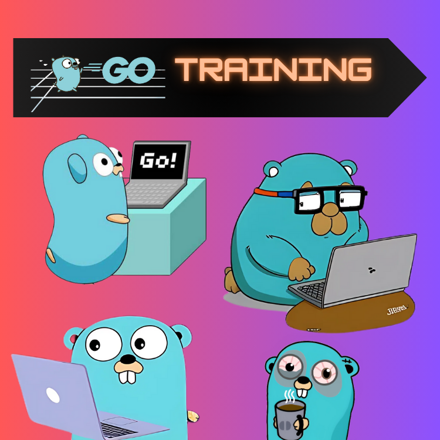

<div align="center">
<br>



</div>


<p align="center">


</p>


<h1 align="center"> Go - Training </h1>


<h3 align="center">
<a href="https://github.com/RazikaBengana/Go_training#eye-about">About</a> •
<a href="https://github.com/RazikaBengana/Go_training#memo-learning-objectives">Learning Objectives</a> •
<a href="https://github.com/RazikaBengana/Go_training#computer-requirements">Requirements</a> •
<a href="https://github.com/RazikaBengana/Go_training#pushpin-more info">More Info</a> •
<a href="https://github.com/RazikaBengana/Go_training#mag_right-resources">Resources</a> •
<a href="https://github.com/RazikaBengana/Go_training#bust_in_silhouette-authors">Authors</a> •
<a href="https://github.com/RazikaBengana/Go_training#octocat-license">License</a>
</h3>

---

<!-- ------------------------------------------------------------------------------------------------- -->

<br>
<br>

## :eye: About

<br>

<div align="center">

**`Go - training`** is a repository of exercises focused on the foundational concepts of `Go`, including **variables**, **functions**, **pointers**, **structs**, **interfaces**, **maps**, **slices**, **channels**, and **error handling**.
<br>
<br>
These exercises provide practical experience, making it an excellent resource for beginners to build a solid understanding of `Go`'s core features.

</div>

<br>
<br>

<!-- ------------------------------------------------------------------------------------------------- -->

## :memo: Learning Objectives

<br>

```diff

+ Understand the basics of Go syntax and semantics

+ Learn how to work with Go's data structures and algorithms

+ Develop skills in concurrent programming using Go's goroutines and channels

+ Gain proficiency in testing and debugging Go applications

+ Explore Go's standard library and third-party packages for building real-world applications

```

<br>
<br>

<!-- ------------------------------------------------------------------------------------------------- -->

## :computer: Requirements

<br>

```diff

+ Go programming language installed on your machine (version 1.16 or higher recommended)

+ A code editor or IDE with Go support (e.g., Visual Studio Code, GoLand)

+ Basic understanding of programming concepts

```

<br>
<br>

<!-- ------------------------------------------------------------------------------------------------- -->

## :pushpin: More Info

<br>

- The exercises cover a wide range of topics, including:

<br>

| Topic           | Description                                                                  |
|-----------------|------------------------------------------------------------------------------|
| Basic Syntax    | Understanding the structure and syntax of Go programs.                       |
| Variables       | Learning how to declare and use variables effectively.                       |
| Functions       | Exploring function declaration, invocation, and scope.                       |
| Pointers        | Gaining insights into memory management and pointer usage.                   |
| Structs         | Working with custom data types and encapsulating data.                       |
| Interfaces      | Implementing and using interfaces for polymorphism.                          |
| Maps            | Using maps for efficient key-value data storage and retrieval.               |
| Slices          | Manipulating slices for dynamic data handling.                               |
| Channels        | Implementing concurrency with channels for communication between goroutines. |
| Error Handling  | Understanding and implementing error handling mechanisms.                    |

<br>
<br>

Each exercise is crafted to reinforce these concepts, making this repository an ideal resource for those new to `Go` and eager to develop a strong foundational knowledge of the language.

<br>
<br>

<!-- ------------------------------------------------------------------------------------------------- -->

## :mag_right: Resources

<br>

**_Do you need some help?_**

<br>

**Read or watch:**

* [Go - Official Website](https://go.dev/)

* [Go - Official Documentation](https://go.dev/doc/)

* [Effective Go](https://go.dev/doc/effective_go)

* [Go by Example](https://gobyexample.com/)

* [Go - Forum](https://forum.golangbridge.org/)

<br>
<br>

<!-- ------------------------------------------------------------------------------------------------- -->

## :bust_in_silhouette: Authors

<br>


<br>
<br>

<!-- ------------------------------------------------------------------------------------------------- -->

## :octocat: License

<br>

```Go - training``` _project has no license specified._

<br>
<br>

---

<p align="center"><br>2024</p>
